# ☁️ AWS Production Deployment - Social Insight

> ✅ **Status**: Successfully Deployed on AWS EC2

Tài liệu này mô tả chi tiết quá trình triển khai hệ thống Social Insight lên AWS, bao gồm kiến trúc, cấu hình và kết quả xác minh.

---

## 📋 Deployment Overview

| Item | Details |
|------|---------|
| **Cloud Provider** | Amazon Web Services (AWS) |
| **Region** | ap-southeast-1 (Singapore) |
| **Architecture** | 3-Tier Microservices |
| **Total EC2 Instances** | 3 |
| **Deployment Date** | January 31, 2026 |
| **Status** | ✅ Production Ready |

---

## 🏗️ Production Architecture

```mermaid
flowchart TB
    subgraph VPC["AWS VPC - ap-southeast-1"]
        subgraph AZ["Availability Zone: ap-southeast-1b/c"]
            
            subgraph EC2_Data["EC2 #1: social-insight-data"]
                direction TB
                D_IP["📍 13.250.47.65"]
                D_Type["m7i-flex.large"]
                D_SG["🔒 data-sg"]
                PG[(PostgreSQL :5432)]
                RD[(Redis :6379)]
                KF[Kafka :9092]
                ZK[Zookeeper :2181]
                KUI[Kafka UI :8080]
            end
            
            subgraph EC2_Proc["EC2 #2: social-insight-processing"]
                direction TB
                P_IP["📍 13.251.157.185"]
                P_Type["m7i-flex.large"]
                P_SG["🔒 processing-sg"]
                HN[HN Crawler]
                DT[DevTo Crawler]
                MD[Medium Crawler]
                CS[Consumer]
            end
            
            subgraph EC2_API["EC2 #3: social-insight-api"]
                direction TB
                A_IP["📍 13.214.56.2"]
                A_Type["t3.small"]
                A_SG["🔒 api-sg"]
                API[REST API :8888]
                WEB[Dashboard]
            end
        end
    end
    
    Internet((🌐 Internet)) --> API
    Internet --> KUI
    HN & DT & MD -->|Kafka| KF
    KF --> CS
    CS --> PG
    CS --> RD
    API --> PG
    API --> RD
```



---

## 🖥️ EC2 Instances

### Instance #1: Data Layer

| Property | Value |
|----------|-------|
| **Name** | social-insight-data |
| **Instance ID** | i-04c5bae5b805527b1 |
| **Instance Type** | m7i-flex.large |
| **Public IP** | 13.250.47.65 |
| **Private IP** | 172.31.16.144 |
| **Security Group** | data-sg |
| **Key Pair** | social-insight-key |

**Running Containers:**
```
CONTAINER ID   IMAGE                             STATUS          PORTS
3746ccb9ed9a   provectuslabs/kafka-ui:latest     Up 23 minutes   0.0.0.0:8080->8080/tcp
672f18a17fe0   confluentinc/cp-kafka:7.5.0       Up (healthy)    0.0.0.0:9092->9092/tcp
24738d86d21e   confluentinc/cp-zookeeper:7.5.0   Up 23 minutes   0.0.0.0:2181->2181/tcp
eea1d84deed4   redis:7-alpine                    Up (healthy)    0.0.0.0:6379->6379/tcp
52ab2a634a0d   postgres:15-alpine                Up (healthy)    0.0.0.0:5432->5432/tcp
```

---

### Instance #2: Processing Layer

| Property | Value |
|----------|-------|
| **Name** | social-insight-processing |
| **Instance ID** | i-0273b893a3bc3cf0b |
| **Instance Type** | m7i-flex.large |
| **Public IP** | 13.251.157.185 |
| **Private IP** | 172.31.16.49 |
| **Security Group** | processing-sg |
| **Key Pair** | social-insight-key |

**Running Containers:**
```
CONTAINER ID   IMAGE                               STATUS          NAMES
a44c3f79f777   processing-service-devto-crawler    Up 23 minutes   processing_devto_crawler
c1bf4d8edf71   processing-service-hn-crawler       Up 23 minutes   processing_hn_crawler
3b8f22baf01f   processing-service-medium-crawler   Up 23 minutes   processing_medium_crawler
0aea17f86214   processing-service-consumer         Up 23 minutes   processing_consumer
```

---

### Instance #3: API Layer

| Property | Value |
|----------|-------|
| **Name** | social-insight-api |
| **Instance ID** | i-0c2de9a57b4f73b4e |
| **Instance Type** | t3.small |
| **Public IP** | 13.214.56.2 |
| **Private IP** | 172.31.8.70 |
| **Security Group** | api-sg |
| **Key Pair** | social-insight-key |

**Running Containers:**
```
CONTAINER ID   IMAGE             STATUS          PORTS                    NAMES
ace431824d80   api-service-api   Up 24 minutes   0.0.0.0:8888->8888/tcp   api_server
```

---

## 🔒 Security Groups Configuration

### data-sg (EC2 #1)
| Port | Protocol | Source | Description |
|------|----------|--------|-------------|
| 22 | TCP | Admin IP | SSH access |
| 5432 | TCP | processing-sg, api-sg | PostgreSQL |
| 6379 | TCP | processing-sg, api-sg | Redis |
| 9092 | TCP | processing-sg | Kafka |
| 2181 | TCP | processing-sg | Zookeeper |
| 8080 | TCP | 0.0.0.0/0 | Kafka UI |

### processing-sg (EC2 #2)
| Port | Protocol | Source | Description |
|------|----------|--------|-------------|
| 22 | TCP | Admin IP | SSH access |

### api-sg (EC2 #3)
| Port | Protocol | Source | Description |
|------|----------|--------|-------------|
| 22 | TCP | Admin IP | SSH access |
| 80 | TCP | 0.0.0.0/0 | HTTP |
| 443 | TCP | 0.0.0.0/0 | HTTPS |
| 8888 | TCP | 0.0.0.0/0 | API Server |

---

## 🚀 Deployment Steps

### Step 1: Prepare EC2 Instances
```bash
# SSH into each instance
ssh -i social-insight-key.pem ubuntu@<EC2_PUBLIC_IP>

# Install Docker & Docker Compose
sudo apt update
sudo apt install -y docker.io docker-compose-v2
sudo usermod -aG docker $USER
```

### Step 2: Clone Repository
```bash
cd /opt
sudo git clone https://github.com/luongtien872003/realtime-social-sentiment-pipline.git social_insight
sudo chown -R ubuntu:ubuntu social_insight
```

### Step 3: Create Docker Network
```bash
docker network create social_insight_network
```

### Step 4: Configure Environment
```bash
# On EC2 #2 and #3, update .env to point to EC2 #1's Private IP
KAFKA_HOST=172.31.16.144:9092
REDIS_HOST=172.31.16.144:6379
PG_HOST=172.31.16.144
```

### Step 5: Start Services (In Order)
```bash
# EC2 #1 (Data)
cd /opt/social_insight/services/data-service
docker compose up -d --build

# EC2 #2 (Processing)
cd /opt/social_insight/services/processing-service
docker compose up -d --build

# EC2 #3 (API)
cd /opt/social_insight/services/api-service
docker compose up -d --build
```

---

## ✅ Verification Results

### 1. All Containers Running
```bash
# Total: 10 containers across 3 EC2 instances
# Status: All containers UP and HEALTHY
```

### 2. Data Flow Verified
```bash
# Check Kafka topics
docker exec data_kafka kafka-topics --bootstrap-server kafka:29092 --list
# Output: raw_posts ✅

# Check Consumer processing
docker logs processing_consumer
# Output: "Saved X posts to PostgreSQL" ✅
```

### 3. API Responding
```bash
curl http://13.214.56.2:8888/api/health
# Output: {"status":"ok"} ✅
```

### 4. Dashboard Accessible
- URL: http://13.214.56.2:8888 ✅
- Kafka UI: http://13.250.47.65:8080 ✅

---

## 🛠️ Challenges & Solutions

| Challenge | Solution |
|-----------|----------|
| **Kafka cross-host connection** | Configured `KAFKA_ADVERTISED_LISTENERS` with Private IP |
| **Security Group blocking** | Added specific inbound rules for inter-service communication |
| **SSH key permissions (Windows)** | Used `icacls` to restrict .pem file permissions |
| **Network timeout on school network** | Opened SSH port to 0.0.0.0/0 temporarily |

---

## 🌐 Production URLs

| Service | URL |
|---------|-----|
| **Dashboard** | http://13.214.56.2:8888 |
| **API Health** | http://13.214.56.2:8888/api/health |
| **API Stats** | http://13.214.56.2:8888/api/stats |
| **Kafka UI** | http://13.250.47.65:8080 |

---

## 📊 System Metrics

| Metric | Value |
|--------|-------|
| **Total Containers** | 10 |
| **Data Sources** | 3 (HackerNews, Dev.to, Medium) |
| **Crawl Interval** | 5-10 minutes |
| **Consumer Batch Size** | 500 posts |
| **API Response Time** | < 100ms |

---

## 💡 Lessons Learned

1. **Network Configuration is Critical**: Private IPs must be used for cross-EC2 communication
2. **Security Groups = Firewall**: Each port must be explicitly opened
3. **Docker Network Isolation**: External network required for cross-compose communication
4. **Kafka Advertised Listeners**: Essential for multi-host deployment
5. **Order of Startup Matters**: Data → Processing → API

---

## 🔮 Future Improvements

- [ ] Add HTTPS with Let's Encrypt (Nginx + Certbot)
- [ ] Set up AWS CloudWatch for monitoring
- [ ] Implement Auto Scaling for API layer
- [ ] Migrate to Amazon RDS for managed database
- [ ] Add CI/CD pipeline with GitHub Actions

---

## 📝 Commands Reference

### SSH Access
```bash
ssh -i social-insight-key.pem ubuntu@13.250.47.65  # Data
ssh -i social-insight-key.pem ubuntu@13.251.157.185  # Processing
ssh -i social-insight-key.pem ubuntu@13.214.56.2  # API
```

### Check Container Status
```bash
docker ps
docker compose logs -f
```

### Restart Services
```bash
docker compose restart
```

---

> 📅 **Last Updated**: January 31, 2026  
> 👨‍💻 **Deployed by**: Luong Tien  
> ☁️ **Platform**: AWS EC2 (ap-southeast-1)