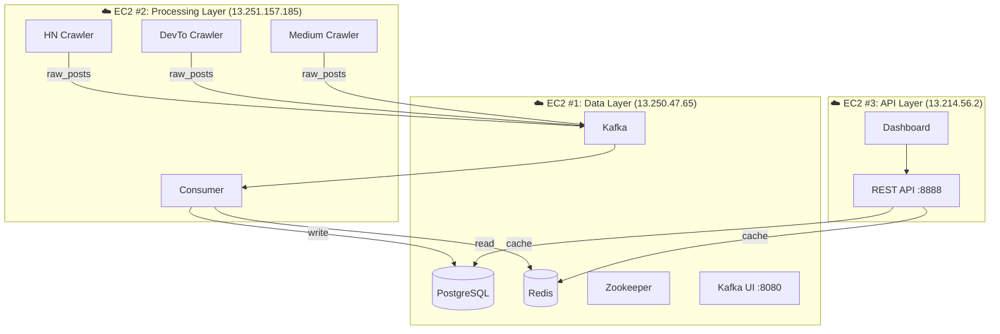

# 🚀 Social Insight

[](https://go.dev/)
[](https://kafka.apache.org/)
[](https://www.postgresql.org/)
[](https://www.docker.com/)
[](https://aws.amazon.com/)

**Real-time Social Media Trend Analysis Platform** - Thu thập, phân tích và trực quan hóa xu hướng bài viết từ HackerNews, Dev.to và Medium.

> 🌐 **Live Demo**: [http://13.214.56.2:8888](http://13.214.56.2:8888)

---

## ✨ Features

- 🔄 **Real-time Data Pipeline**: Thu thập liên tục từ 3 nguồn với Kafka message queue
- 📊 **Trend Analysis**: Phân tích chủ đề, sentiment và top authors
- 🎯 **Interactive Dashboard**: Giao diện trực quan với Chart.js
- ☁️ **Production Ready**: Đã deploy thành công trên AWS EC2 (3-tier architecture)

---

## 🏗️ System Architecture



---

## 📊 Data Flow

```
┌─────────────┐     ┌─────────────┐     ┌─────────────┐     ┌─────────────┐
│  HackerNews │     │   Dev.to   │     │   Medium    │     │   Sources   │
│   Crawler   │     │   Crawler   │     │   Crawler   │     │   (APIs)    │
└──────┬──────┘     └──────┬──────┘     └──────┬──────┘     └─────────────┘
       │                   │                   │
       └───────────────────┼───────────────────┘
                           ▼
                  ┌─────────────────┐
                  │   Kafka Topic   │
                  │   (raw_posts)   │
                  └────────┬────────┘
                           ▼
                  ┌─────────────────┐
                  │    Consumer     │
                  │ (Go Application)│
                  └────────┬────────┘
                           │
              ┌────────────┴────────────┐
              ▼                         ▼
     ┌─────────────────┐       ┌─────────────────┐
     │   PostgreSQL    │       │     Redis       │
     │   (Storage)     │       │    (Cache)      │
     └────────┬────────┘       └────────┬────────┘
              │                         │
              └────────────┬────────────┘
                           ▼
                  ┌─────────────────┐
                  │    REST API     │
                  │   (Go Server)   │
                  └────────┬────────┘
                           ▼
                  ┌─────────────────┐
                  │   Dashboard     │
                  │   (Web UI)      │
                  └─────────────────┘
```

---

## 🛠️ Tech Stack

| Layer | Technology | Purpose |
|-------|------------|---------|
| **Crawlers** | Go 1.21 | Thu thập dữ liệu từ APIs |
| **Message Queue** | Apache Kafka 7.5 | Streaming data pipeline |
| **Database** | PostgreSQL 15 | Lưu trữ bài viết |
| **Cache** | Redis 7 | Cache dữ liệu real-time |
| **API Server** | Go (net/http) | REST API endpoints |
| **Frontend** | HTML/CSS/JS + Chart.js | Interactive dashboard |
| **Container** | Docker & Compose | Containerization |
| **Cloud** | AWS EC2 | Production deployment |

---

## 🚀 Quick Start (Local)

### Prerequisites
- Docker & Docker Compose
- Git

### 1. Clone Repository
```bash
git clone https://github.com/luongtien872003/realtime-social-sentiment-pipline.git
cd realtime-social-sentiment-pipline
```

### 2. Start Services (Order Matters!)
```bash
# Step 1: Data Layer (PostgreSQL, Redis, Kafka)
cd services/data-service
docker network create social_insight_network
docker-compose up -d

# Step 2: Processing Layer (Crawlers, Consumer)
cd ../processing-service
docker-compose up -d --build

# Step 3: API Layer (REST API, Dashboard)
cd ../api-service
docker-compose up -d --build
```

### 3. Access Dashboard
```
🌐 http://localhost:8888
📊 Kafka UI: http://localhost:8080
```

---

## 📡 API Endpoints

| Method | Endpoint | Description |
|--------|----------|-------------|
| GET | `/api/health` | Health check |
| GET | `/api/stats` | Overall statistics |
| GET | `/api/recent` | Recent posts |
| GET | `/api/topics` | Topic distribution |
| GET | `/api/sentiment` | Sentiment analysis |
| GET | `/api/trending` | Top trending posts |
| GET | `/api/compare` | Today vs Yesterday |

### Example
```bash
curl http://localhost:8888/api/stats | jq .
```

---

## ☁️ AWS Deployment

Hệ thống đã được deploy thành công trên **AWS EC2** với kiến trúc 3-tier:

| Instance | IP | Type | Role |
|----------|------|------|------|
| social-insight-data | 13.250.47.65 | m7i-flex.large | PostgreSQL, Redis, Kafka |
| social-insight-processing | 13.251.157.185 | m7i-flex.large | Crawlers, Consumer |
| social-insight-api | 13.214.56.2 | t3.small | REST API, Dashboard |

📖 **Chi tiết deployment**: Xem [DEPLOY.MD](./DEPLOY.MD)

---

## 📁 Project Structure

```
Social_Insight/
├── services/
│   ├── data-service/          # PostgreSQL, Redis, Kafka, Zookeeper
│   │   ├── docker-compose.yml
│   │   ├── migrations/
│   │   └── README.md
│   │
│   ├── processing-service/    # Crawlers + Consumer
│   │   ├── cmd/crawlers/      # HN, DevTo, Medium crawlers
│   │   ├── cmd/consumer/
│   │   ├── docker-compose.yml
│   │   └── README.md
│   │
│   └── api-service/           # REST API + Dashboard
│       ├── cmd/api/
│       ├── web/               # Frontend files
│       ├── docker-compose.yml
│       └── README.md
│
├── README.md                  # This file
├── DEPLOY.MD                  # AWS deployment guide
└── .github/workflows/         # CI/CD (optional)
```

---

## 📈 Monitoring

### Check Container Status
```bash
docker ps
```

### View Logs
```bash
# Consumer logs (see data processing)
docker logs -f processing_consumer

# API logs
docker logs -f api_server
```

### Kafka UI
Access [http://localhost:8080](http://localhost:8080) to monitor:
- Broker status
- Topic messages
- Consumer groups

---

## 🔧 Configuration

Each service has its own `.env` file. Copy from `.env.example`:

```bash
cp .env.example .env
```

Key configurations:
- `KAFKA_HOST`: Kafka broker address
- `PG_HOST`: PostgreSQL host
- `REDIS_HOST`: Redis host
- `API_PORT`: API server port (default: 8888)

---

## 📝 License

MIT License - See [LICENSE](./LICENSE)

---

## 👨‍💻 Author

**Luong Tien**
- GitHub: [@luongtien872003](https://github.com/luongtien872003)

---

> Built with ❤️ using Go, Kafka, PostgreSQL, Redis, and Docker
